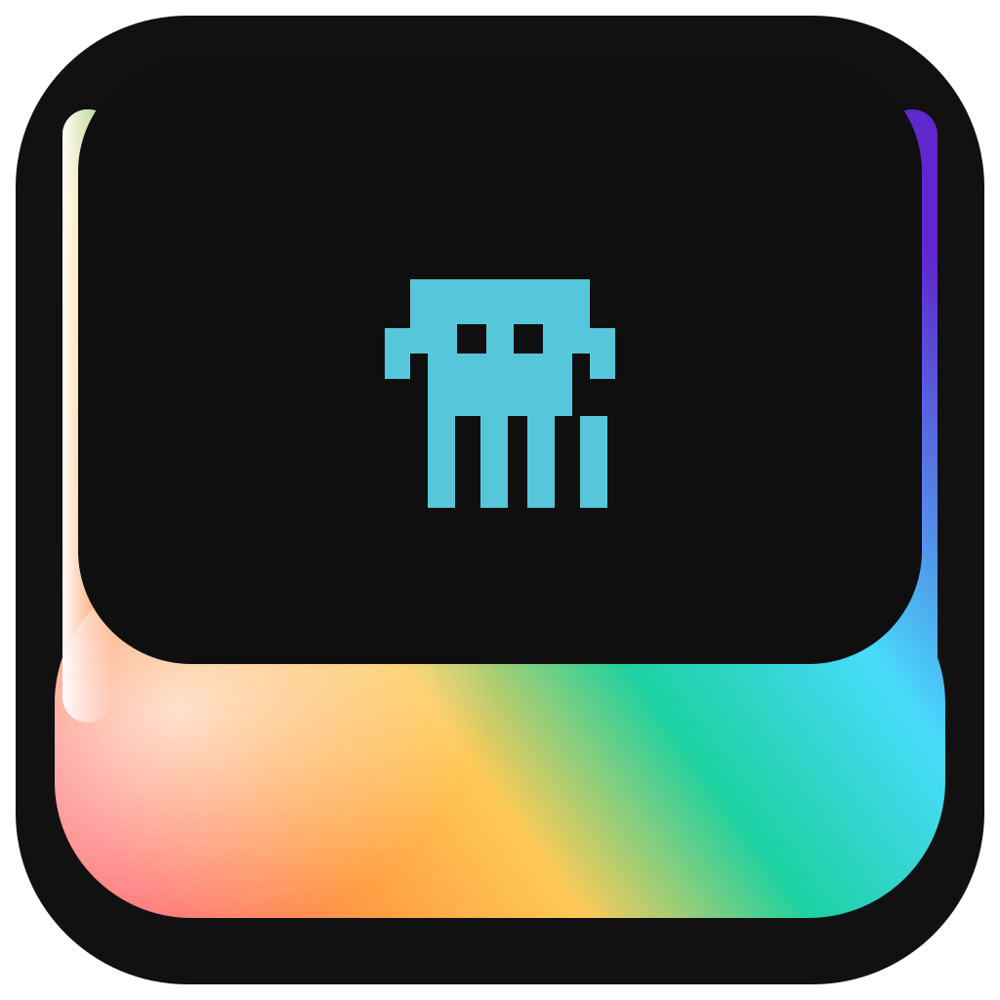

<div align="center">
  
  <h1 align="center">Vibe Island</h1>
  <p align="center">
    面向 Codex CLI 的 macOS 刘海区与菜单栏伴侣应用。
  </p>
  <p align="center">
    <a href="./README.md">English</a>
    ·
    <a href="https://github.com/PadishahIII/vibe-island/releases/latest">最新版本</a>
  </p>
</div>

Vibe Island 用来盯住本地运行中的 Codex 会话，并把状态变化放到 macOS 的 Dynamic Island 风格浮层里。它适合长期把 Codex 跑在终端里的用户，让你不用一直盯着终端窗口，也能及时看到状态、审批请求和最近上下文。

## 功能概览

- 通过 `~/.codex/hooks.json` 和本地 Unix Socket 监听 Codex 会话。
- 从刘海区域展开，展示会话状态、等待输入、工具执行等信息。
- 内置最近对话历史查看，并支持 Markdown 渲染。
- 可直接在应用界面里处理审批流。
- 支持同时跟踪多个会话，并在会话之间切换。
- 提供开机启动、屏幕选择、提示音、应用内更新等能力。
- 在没有实体刘海的 Mac 上也能正常工作。

## 运行要求

- macOS 15.6 或更高版本
- 本地已安装 Codex CLI
- 如果需要窗口聚焦相关能力，需要授予辅助功能权限
- 如果要使用基于 tmux 的消息发送和审批流程，需要安装 `tmux`
- 如果要使用窗口聚焦集成，需要安装 `yabai`

## 安装

可以直接下载 GitHub Release，也可以本地构建。

调试构建：

```bash
xcodebuild -scheme CodexIsland -configuration Debug build
```

发布构建：

```bash
./scripts/build.sh
```

导出的 Vibe Island 应用位于 `build/export/Vibe Island.app`。

如果当前机器没有配置 Apple 团队，`./scripts/build.sh` 会先完成归档，再导出一个未签名的 `.app`，用于本地使用或手工签名。要生成签过 `Developer ID` 的导出包，请在执行时传入 `DEVELOPMENT_TEAM=<YourTeamID>` 或 `VIBE_ISLAND_TEAM_ID=<YourTeamID>`。

## 工作原理

首次启动时，Vibe Island 会把受管的 hook 脚本安装到 `~/.codex/hooks/`，并更新 `~/.codex/hooks.json`。hook 脚本会把 Codex 的事件通过 Unix Domain Socket 转发给应用，应用再结合 transcript 信息做状态对账，以保持会话展示尽量准确。

当前实现仍然是以 macOS 进程内的 hooks 流程为主。仓库里的 `sidecar/` 目录是预留给后续 Rust sidecar 的脚手架，计划承接 transcript 解析、状态聚合和本地 IPC 等职责。

## 项目结构

- `CodexIsland/App/`：应用生命周期和窗口启动
- `CodexIsland/Core/`：设置、几何计算、屏幕选择等基础能力
- `CodexIsland/Services/`：hooks、会话解析、tmux 集成、更新、窗口管理
- `CodexIsland/UI/`：刘海视图、菜单界面、聊天界面和复用组件
- `CodexIsland/Resources/`：随应用分发的脚本资源，例如 `vibe-island-state.py`
- `scripts/`：构建、签名、公证、发布辅助脚本
- `sidecar/`：预留的 Rust sidecar 脚手架

## 隐私与遥测

当前应用集成了 Mixpanel 用于匿名产品分析，也集成了 Sparkle 用于应用更新。

代码里可见的分析事件主要围绕以下信息：

- 应用版本与构建号
- macOS 版本
- 检测到的 Codex 版本
- 会话启动事件

仓库当前没有声明会把对话内容发送到分析服务，但如果你计划在更敏感的环境里分发或使用，仍然应该先自行审查代码，再决定是否接受这部分取舍。

## 开发

日常开发直接用 Xcode 即可。仓库也带了完整的发布辅助脚本，可用于签名、公证、生成 DMG、生成 appcast，以及可选地发布 GitHub Release：

```bash
./scripts/create-release.sh
```

`./scripts/create-release.sh` 默认假设输入的是已经完成 `Developer ID` 签名的应用。如果你前一步只做了未签名的本地导出，需要先带上有效 Team ID 重新执行 `./scripts/build.sh`，再继续发布流程。

如果改动了 `CodexIsland/Services/Hooks/` 或 `CodexIsland/Resources/vibe-island-state.py`，要把它视为会直接影响用户本地 Codex 环境的高风险改动，务必手工验证。

## 致谢

Vibe Island 建立在原项目 [`farouqaldori/claude-island`](https://github.com/farouqaldori/claude-island) 的思路和早期实现之上。感谢 Farouq Aldori 以及上游贡献者打下基础，这个面向 Codex 的版本是在那套工作的延续上继续演进的。

## 许可证

Apache 2.0，详见 [`LICENSE.md`](./LICENSE.md)。
